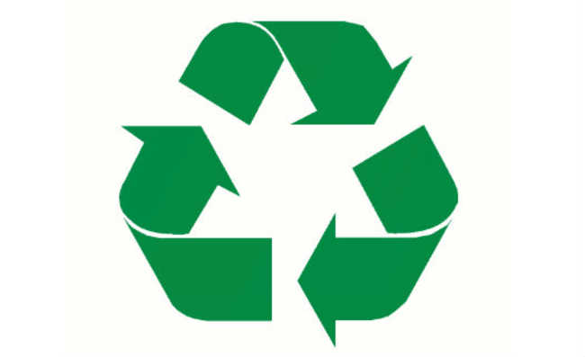

# E-Coleta

  

---

  <bold>It was made during the first NextLevelWeek, by RocketSeat</bold> :rocket:

---

It's a fullstack project, composed by a front-end made with ReactJS, and a back-end made with NodeJS (ExpressJS). It uses
mongoose to manage the database, and some other libs (detailed below).

---

## The project

The project's main idea is to be a repository of recycling points.
A business/person can register themself as a "receiver of recycling material".

When the user wants to discard some material, he can search for the nearest point of your house. Finding some on of those receivers.

The application has a map to help both the user with their search, as the business with their registration.

It used TypeScript, rather than "vanilla javascript", because of teaching purposes. The main goal of this application is to teach, test, and discover!

## What was used?

All the code are typed in TypeScript. What I thought was a problem at the beginning, but surprisingly it wasn't, it was so much fun and I've learned a new way of solving problems.

The back-end was made with the classic duo NodeJS and Express, working together with knex.

Yes, you didn't read it wrong! This project didn't use mongoose and MongoDB. It uses Knex and SQLite for databasing purposes.

The front-end it's basically "vanilla react". 

It's used Axios for making the requests, Router to make the routes and React-Icons for adding some icons to our UI.

The real interesting thing here is the use of leaftlet lib. An open-source lib dedicated to print maps, which can easily be integrated with react!

I loved to work with leaflet, and now, I'm searching for another project that fits in.

---
